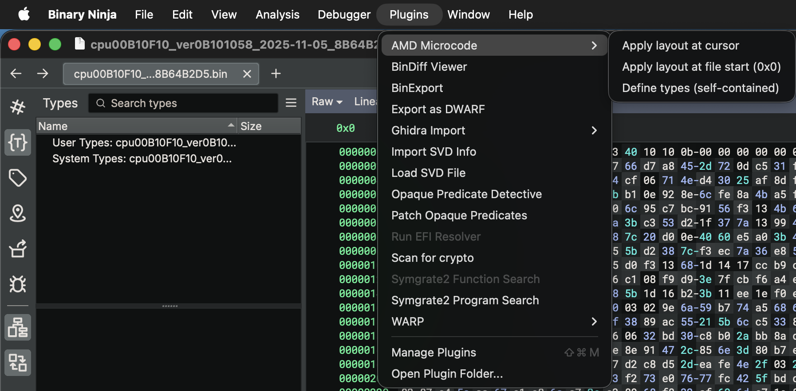

  

# AMD Zen Microcode Update Reversing (call it `Zenella`) (Binary Ninja Plugin)

This plugin adds a set of **Binary Ninja menu commands** for reversing AMD Zen microcode update `.bin` blobs. It auto-detects the Zen profile, parses the update container (header, signature/modulus, match registers), and analyzes the payload:

- **Zen 1 / Zen 2**: microcode is **disassembled and LLIL-lifted** as a Binary Ninja architecture, Binary Ninja derives MLIL/HLIL automatically, so you get graph, cross-references, and decompilation over the 64 4-µop packages.
- **Zen 5**: the `0x3820` container gets a structural/tag layout (header, blocks, µcode region as 4-byte micro-ops). An **experimental** command additionally renders those tags as an assembly-like listing, this is a structural tag view, **not** a real ISA decode (the Zen 5 micro-op ISA is undocumented).

## Requirements

- **Binary Ninja** (Desktop) with Python scripting enabled (standard)
- **Python**: use the Python runtime embedded in Binary Ninja (you do not need a system Python for the plugin itself)

## Installation / Setup

### 1) Locate the plugin directory
In Binary Ninja:
- `Plugins` -> `Open Plugin Folder...` 
  Example: `/Users/ercihan/Library/Application\ Support/Binary\ Ninja/plugins`

### 2) Copy the plugin file
Place the plugin into e.g. `/Users/ercihan/Library/Application\ Support/Binary\ Ninja/plugins` path and restart Binary Ninja.

### 3) Check plugins
As soon as the Binary Ninja has been restarted you should see a menu like this: 

## Menu Commands and What They Do

All commands live under the **`AMD Microcode`** menu. The key ones:

- **`Auto-detect and analyze at file start` / `at cursor`**, detect Zen1/Zen2/Zen5, annotate the container, and lift Zen1/Zen2 packages.
- **`Define Zenella types (Zen1/Zen2/Zen5)`**, register the struct/enum types used for navigation.
- **`Zen1 > …` / `Zen2 > …`**, `Apply layout + LLIL/HLIL` at file start or cursor for a specific profile.
- **`Zen5 > Apply structural layout`**, apply the `0x3820` structural/tag layout at file start or cursor.
- **`Zen5 > (Experimental) Disassemble tags to assembly`** (file start / cursor), render each 4-byte structural tag as an assembly-like line (`offset: bytes  mnemonic  b1=.. imm16=..`). No ISA semantics inferred; unknown tags show as `.op 0xNN`. Tag view only, not a true Zen5 decode.
- **`Zen1-Zen2 > …`**, ZenUtils-style disassembly report and aggressive/compact package analysis.

Cursor variants use the current address as base, for blobs embedded in a larger container. Partial blobs are applied partially or warned about.

## Common Workflow
1) Drop the plugin (`amd_zen_ucode.py` + `zenella_core.py`) into the `plugins/` folder
2) Restart Binary Ninja
3) Open a microcode `.bin`
4) Run `Auto-detect and analyze at file start`

## Common workflow in action (video)
<video controls width="720">
  <source src="media/demoVideoZenellaV1.2.mp4" type="video/mp4">
  Your browser does not support the video tag.
</video>

https://github.com/user-attachments/assets/d15d805b-866c-4494-bcf9-918ed7bc2ea7

