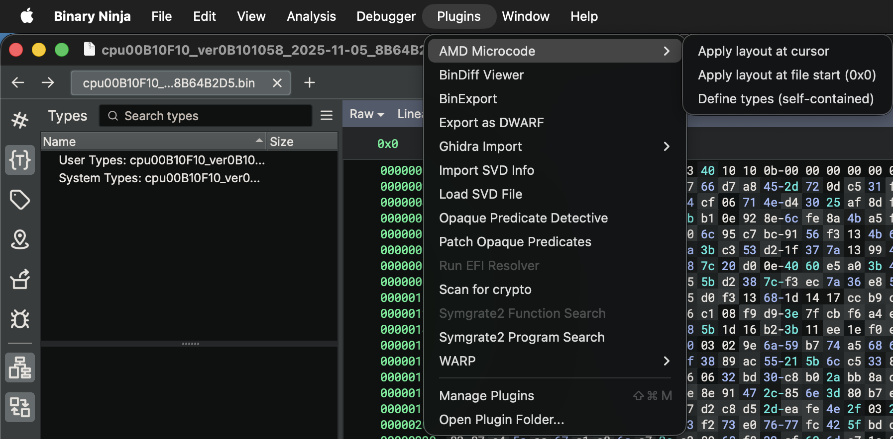

<p align="center">
  
</p>

# AMD Zen Microcode Update Reversing (call it `Zenella`) (Binary Ninja Plugin)

**Version 2.2.0** · Binary Ninja, Python 3 · Targets Zen 1, Zen 2, Zen 5 · GPL-3.0

Zenella is a Binary Ninja plugin for AMD Zen microcode update `.bin` blobs. Open an update, run one command, and the container is typed and labelled: header, RSA material, options, match registers and the microcode body. The plugin reads the header, picks the matching profile and applies it to the bytes in front of you.

- **Zen 1 / Zen 2** (`0xC80`-byte updates): the container is typed and the 64 instruction packages are mapped as code under a Binary Ninja architecture (`amd_zen1_ucode` / `amd_zen2_ucode`). Micro-ops are disassembled in the ZenUtils style and **lifted to LLIL**; Binary Ninja derives MLIL/HLIL, so graph view, cross-references and decompilation work as for any other target.
- **Zen 5** (`0x3820`-byte updates): the loader ID selects the geometry. For loader `0x8015` the register area holds **31 match and 31 mask words** at `0x328`, so the op-quads start at **`0x420`** and run up to the trailing zero padding. Each op-quad is four 64-bit micro-ops (`AMD_Zen5_MicroOp64`) plus a 32-bit `sequence_word` (36 bytes, `AMD_Zen5_OpQuad`). A type-specific **DataRenderer** shows every micro-op in Linear view as `opcode = AMD_ZEN_… rd=.. rs=.. rt=.. imm16=.. size=.. ld=.. st=.. class=N (name) asm=…`. The NOP run and the finalization sequence inside the body are carved out as their own labelled sections. Nothing is lifted or executed for Zen 5; the sequence word is annotated, not interpreted as control flow.
- The Zen 5 apply runs in **one undoable transaction** and verifies the applied types against the bytes before the transaction commits, so a wrong guess costs you a Ctrl‑Z.
- The decoder lives in `zenella_core.py` and has **no Binary Ninja dependency**. The same code drives `zenella_inspect.py`, a command-line tool that prints the structural report or JSON for a file without opening the GUI.

> **Zen 5 note:** the micro-op field layout (opcode at bits 47..54, registers, immediate, size, load/store, execution unit) is an **empirical inference**, not a vendor-confirmed ISA. Opcode and field names come from the published ZenUtils / zentool research. The bit groups `imm_flags`, `flags`, `mid` and `hi` are not yet understood, and the `asm=` operand projection is marked as inferred. The Experimental submenu exists precisely because some of the geometry is still being worked out.

## Zen 5 update layout (loader `0x8015`)

| Symbol | Offset | Size | Type | Contents |
|---|---|---|---|---|
| `amd_mc_header` | `0x0000` | `0x20` | `AMD_MC_Header` | Date, revision, loader ID, patch size, CPUID, flags |
| `amd_mc_signature` | `0x0020` | `0x100` | `u8[256]` | RSA signature |
| `amd_mc_modulus` | `0x0120` | `0x100` | `u8[256]` | Public key modulus |
| `amd_mc_check` | `0x0220` | `0x100` | `u8[256]` | Check block |
| `amd_mc_options` | `0x0320` | `0x04` | `AMD_MC_UcodeOptions` | autorun, encrypted flag, loader ID (this copy at `+0x322` selects the layout) |
| `amd_mc_rev` | `0x0324` | `0x04` | `u32` | Second copy of the update revision |
| `amd_mc_match_regs` | `0x0328` | `0x7C` | `AMD_MC_MatchRegisterBlock` | 31 match registers |
| `amd_mc_mask_regs` | `0x03A4` | `0x7C` | `AMD_MC_MaskRegisterBlock` | 31 mask registers |
| `amd_ucode_body` | `0x0420` | to padding | `AMD_Zen5_OpQuad[]` | Op-quads; NOP run and finalization carved out as `amd_mc_nop_section` / `amd_mc_finalization_section` |
| `amd_mc_zero_padding` | after body | to `0x3820` | `u8[]` | Trailing zeros |

The op-quad count follows the padding, so it can differ between updates; the two reference updates (revisions `0x0B10104E` and `0x0B101054`) contain 300. Loader `0x8010` keeps a searched equal match/mask split; `0x8004` and `0x8005` use zentool's fixed tables. Other loader IDs get scoped block types of their own width.

### Micro-op bitfield (`AMD_Zen5_MicroOp64`, 8 bytes)

| Bits | Field |
|---|---|
| `0–15` | `imm16` |
| `16–20` | `imm_flags` |
| `21–25` | `rt` |
| `26–30` | `rs` |
| `31–35` | `rd` |
| `36–41` | `flags` |
| `42–44` | `size` |
| `45` | `load` |
| `46` | `store` |
| `47–54` | `opcode` (`AMD_Zen_Opcode`) |
| `55–58` | `mid` |
| `59–61` | `exec_unit` (`spec`, `br`, `ld`, `stn`, `st`, `regx`, `reg`) |
| `62–63` | `hi` |

For comparison, Zen 1 / Zen 2 updates place 22 packed match entries (`AMD_Zen12_MatchEntry[22]`) at `0x328` and 64 packages (`AMD_Zen12_InstructionPackage[64]`, four 64-bit instructions plus a sequence word each) at `0x380`.

## Requirements

- **Binary Ninja** (Desktop) with Python scripting enabled (standard)
- **Python**: the Python 3 runtime embedded in Binary Ninja, no extra packages
- For the command-line tool only: any Python 3.8 or newer, standard library only

## Installation / Setup

Zenella is a **plugin folder**, not a single file. It consists of `__init__.py`, `amd_zen_ucode.py`, `zenella_core.py`, `zenella_inspect.py` and the optional `cpuid_descriptions.json`.

### 1) Locate the plugin directory
In Binary Ninja: `Plugins` -> `Open Plugin Folder...`, or go straight there:

```
~/Library/Application Support/Binary Ninja/plugins/   # macOS
%APPDATA%\Binary Ninja\plugins\                       # Windows
~/.binaryninja/plugins/                               # Linux
```

### 2) Copy the whole directory into it
Clone or download the repository and place the entire directory inside the plugin folder:

```
cd ~/Library/Application\ Support/Binary\ Ninja/plugins/
git clone https://github.com/ercihan/zenella.git
```

Remove any older single-file copy of `amd_zen_ucode.py` first. The plugin refuses to apply a layout when it finds a second Zenella module loaded, or when the three modules carry different versions or live in different directories.

### 3) Restart Binary Ninja
The **AMD Microcode** submenu appears under **Plugins**. The log shows the loaded version and the path it was loaded from, which is handy if a stale copy is still around.<br>


## Menu Commands and What They Do

All commands live under **`Plugins` -> `AMD Microcode`**. Each apply command comes in two forms: **at file start** for a standalone update and **at cursor** for an update embedded in a larger image, where the cursor marks the header. Partial blobs are applied partially or warned about.

- **`Auto-detect and apply at file start` / `at cursor`**: reads the header, decides between Zen 1, Zen 2 and Zen 5 from the processor signature (with a size fallback for Zen 5), and runs the matching apply. This is the one to start with. The log tells you which profile was chosen and why.
- **`Zen1 > Apply layout + LLIL/HLIL at file start` / `at cursor`** and **`Zen2 > …`**: type the container, map the 64 packages as executable code under the Zen 1 or Zen 2 architecture and let Binary Ninja lift them. Pick the generation yourself if auto-detect has no opinion (a `0xC80` blob with an unknown CPUID cannot be told apart by size).
- **`Zen1-Zen2 > Show ZenUtils-style disassembly at file start` / `at cursor`**: prints a plain-text listing of the header directives, the 44 logical match registers and all packages in the format ZenUtils users know, as a report tab.
- **`Zen5 > Apply structural layout at file start` / `at cursor`**: applies the confirmed loader `0x8015` layout (31 match and 31 mask registers at `0x328`, op-quads from `0x420` to the zero padding). Defines the types, creates the data variables and symbols from the table above, annotates sequence words, and verifies the result before the transaction commits. Other loader IDs get their own geometry.
- **`Zen5 > Experimental > …`** (file start only): four alternative Zen 5 geometries for research. None is the default and none carries documented evidence; they exist so a hypothesis can be applied and compared quickly.
  - **`Apply exact-fit 0x418/370 (no tail) at file start`**: zentool's boundary, 60 register words and 370 op-quads.
  - **`Apply best-scoring body offset (scan) at file start`**: tries register-area sizes and keeps the one whose sequence words look most reasonable.
  - **`Apply tail match-mask model (no trailer, valid sequences) at file start`**: metadata before the op-quads, equal match/mask registers after them.
  - **`Set match/mask register counts (move boundary) at file start`**: type the DWORD counts yourself; the body boundary moves to `0x328 + 4 * (match + mask)`.

All Zenella comments are prefixed (`Zenella.layout:`, `Zenella.section:`, `Zenella.uop[...]:`, `Zenella.seq[...]:`) so your own notes survive a re-apply. The CPUID in the header is expanded and commented with the matching processor description from `cpuid_descriptions.json`; a small built-in table is used if the file is missing.

## Command-line tool (without Binary Ninja)

`zenella_inspect.py` prints the same Zen 5 regions, body sections, op-quads, sequence words and alignment diagnostics as text or JSON. It is read-only (never writes the input), uses only the standard library and is useful for diffing updates or checking a layout before touching a database. It handles Zen 5 (Family 1Ah) updates only.

```
python3 zenella_inspect.py update.bin                  # regions, op-quads, sequence words
python3 zenella_inspect.py update.bin --json           # everything as JSON
python3 zenella_inspect.py update.bin --layout exact   # force an alternative geometry
python3 zenella_inspect.py image.bin --base 0x1000     # embedded update
```

| Option | Meaning |
|---|---|
| `--base OFFSET` | offset of an embedded update inside a larger file |
| `--layout {auto,loader,exact,scan,tail,sample-420,zentool,raw}` | geometry to apply (`auto`/`loader` follow the loader ID at `+0x322`) |
| `--register-split MATCH:MASK` | override the match/mask DWORD counts (default for `0x8015` is `31:31`) |
| `--scan-boundary` | print a ranked scan of candidate body offsets |
| `--json` | emit JSON with all region bytes and records |
| `--output PATH` | write the report to a file instead of stdout |
| `--no-diagnostics` | omit the alignment comparisons |

Exit status is `0` on success and `2` on an I/O or parse error.

## Types the plugin defines

All structures are packed. Names from Zenella 1.2 are kept, so scripts and existing databases keep working; new names are prefixed with the generation.

- Shared: `AMD_MC_Header`, `AMD_MC_CpuId`, `AMD_MC_LoaderIdTag` (`0x8004`, `0x8005`, `0x8010`, `0x8015`, `0x8016`), `AMD_MC_UcodeOptions`.
- Zen 5: `AMD_Zen5_MicroOp64`, `AMD_Zen5_OpQuad`, `AMD_MC_MatchRegisterBlock`, `AMD_MC_MaskRegisterBlock`, `AMD_MC_Patch` (also registered as `AMD_Zen5_Patch`), and the `AMD_Zen_Opcode` enum. Opcode values above `0xFF` (`AMD_ZEN_LD`, `AMD_ZEN_ST`) are synthetic: a load/store op is identified by its class, not by the opcode bits.
- Zen 1 / Zen 2: `AMD_Zen12_UcodeOptions`, `AMD_Zen12_MatchEntry`, `AMD_Zen12_InstructionPackage`, `AMD_Zen12_ExecutablePayload`, `AMD_Zen12_Patch`.

## Common Workflow
1) Place the plugin directory in the `plugins/` folder
2) Restart Binary Ninja
3) Open a microcode `.bin` as a raw file (for an update inside a firmware image, open the image and put the cursor on the update header)
4) Run `AMD Microcode` -> `Auto-detect and apply at file start` (or the cursor variant)
5) Read `amd_mc_header` in Linear view: date, revision, loader ID and the expanded CPUID with the processor name as a comment
6) Zen 1 / Zen 2: jump into the lifted packages and use graph or HLIL view. Zen 5: scroll `amd_ucode_body`; every op-quad is decoded, and the NOP run and finalization sequence are labelled so you can skip them

## Common workflow in action (video)
Applying the layout to a Zen 5 update:

<video controls width="720">
  <source src="media/workflowExample.mp4" type="video/mp4">
  Your browser does not support the video tag.
</video>

https://github.com/user-attachments/assets/ee68d1ea-b8fb-478a-8a3e-c21d8ae99a45

Earlier Zen 1 / Zen 2 demo (Zenella 1.2):

https://github.com/user-attachments/assets/d15d805b-866c-4494-bcf9-918ed7bc2ea7
